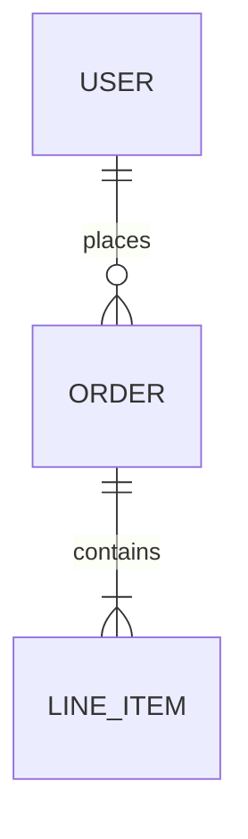
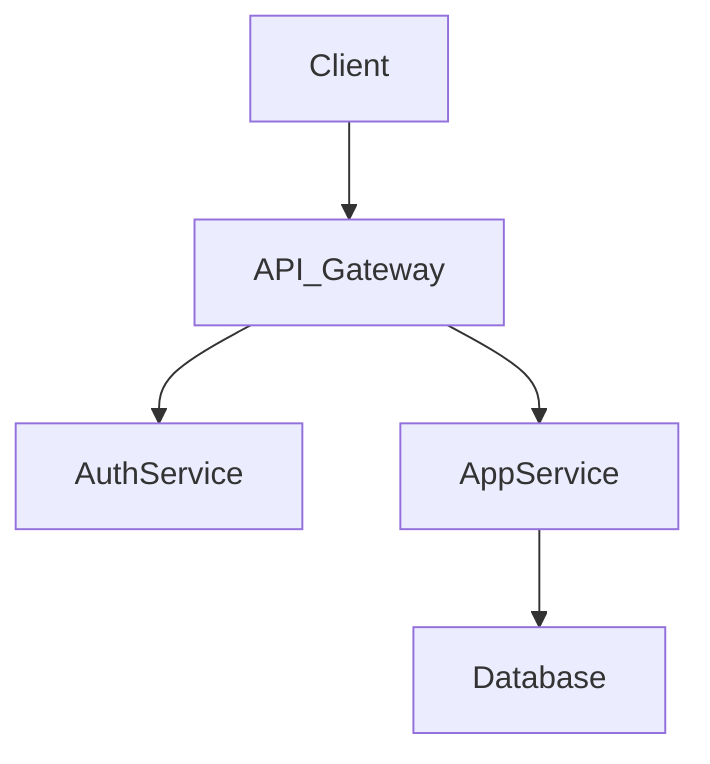

# Skill: architect-system

## Purpose

Activate this skill when transitioning from the Planning phase to Development. You will produce the technical blueprint that the Development Agent implements against.

## Prerequisites

Before activating this skill, verify:
- [ ] `docs/planning/planning.md` exists
- [ ] `docs/planning/user-stories.md` exists
- [ ] `docs/planning/acceptance-criteria.md` exists

If any are missing, halt and return `STATUS: BLOCKED | NEXT_AGENT: planning-agent`.

## Instructions

### 1. Analyze Requirements
Read all files in `docs/planning/`. Identify:
- Core entities and their relationships
- System boundaries and external integrations
- Non-functional requirements (performance, scale, security)

### 2. Define Tech Stack
Select and document:
- Runtime / language with version
- Frameworks and key libraries
- Database(s) and caching layer
- External APIs and services

### 3. Design Data Model
Produce an entity-relationship diagram in Mermaid:


### 4. Define API Contracts
For each user story, define the API surface:
```yaml
POST /api/auth/login:
  request: { email: string, password: string }
  response: { token: string, user: UserDTO }
  errors: [401, 422]
```

### 5. Draw System Architecture
Produce a Mermaid flowchart showing services, data flows, and boundaries:


### 6. Write Output
Write everything to `docs/arch/architecture.md`. Include:
- Tech stack table
- ER diagram
- API contract definitions
- System architecture diagram
- Key design decisions and rationale

## Constraints

- Do NOT write any `src/` code while using this skill
- Keep dependencies minimal — justify every addition
- Flag any security-sensitive design decisions for the Security Agent

## Handoff

```
STATUS: COMPLETE
PHASE: design-and-prototyping
ARTIFACTS: docs/arch/architecture.md
NEXT_AGENT: development-agent
NOTES: Architecture approved. Dev agent should implement against API contracts in section 4.
```
